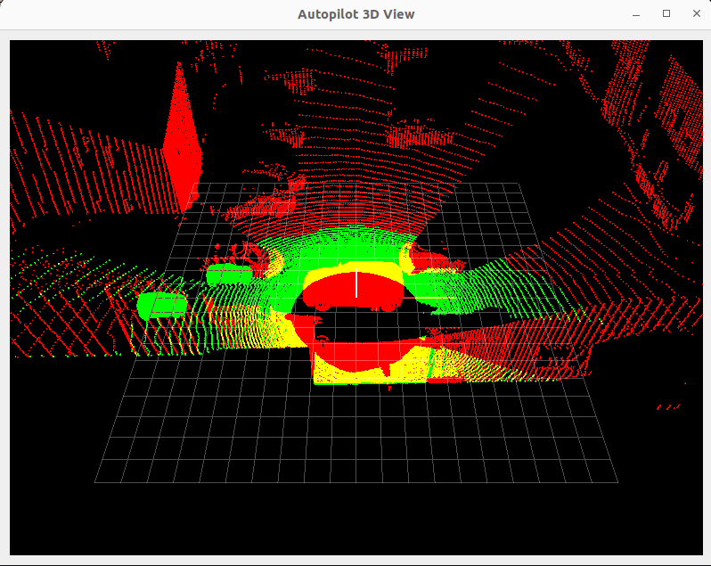

# bve_with_YOLO
 
This repo contains the project, that creates bird's eye view representation of data from sensors of autonomus vehicle.
The visual data aquierd from cameras is used by YOLO network for detecting vehicles, and marking their location

